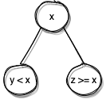
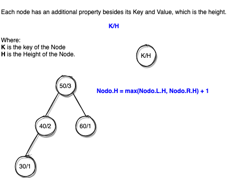

# RBTree and AVLTree

> Data Structure implemented according to the theory of the book [Introduction to Algorithms, Third Edition](https://mitpress.mit.edu/books/introduction-algorithms-third-edition).

+ This repository has the propouse of showing how to implement AVLTree and RBTree froma BinaryTree, which are writen in Python3.
+ The basic classes are the BTree, which uses a BNode, from where the classes AVLThree, RBTree, AVLNode, and RBNode inherit, as the Class Diagram shows.
+ The BTree, and its inheritance, can implement their own comparator class which performence the *Les Than* and *Equal Than* coparations to implement the data structure.


The rule which is used to decide which branch shall alocate each node is:

+ **<** For Left child.
+ **>=** For Right child.



----------

# BTree

The BTree  Class provides the basic operations that most of them will be used into the AVLTree and RBTrees. These operations and properties are:

## Properties

### BNode

| Propertie | Type | Desc |
|--|--|--|
| **parent** | BNode | Reference to its parent. |
| **left** | BNode | Reference to its left child. |
| **right** | BNode | Reference to its right child. |
| **key** | Any | The key of the node, it must be able to compare with a less-than (<) operator |
| **value** | Any | The value of the node, which is related to the key. |
        

### BTree
| Propertie | Type | Desc |
|--|--|--|
| **Nil** | Any | Pointer to None or an specific node (for RBTree) which works as the end of the tree |
| **root** | BNode | The root node of the tree. |
| **count** | integer | The amount of node into the tree |
| **cmp** | Comparator | A class that implements the comparation function, which usually is Less Than (<) |


## Methods

These operations implement the methods to navigate into the Tree, all of them can be use in AVLTree and RBTree.


### Begin & End

> **Complexity**: *O(1)*

> **Returns:**
> The node wich represent the begin or end of the tree, or **None** if there is no nodes.

These operations return the Begin node (Max Node) and End Node (Min Node) into the tree. These methods are designed to work with **Next** and **Prev** operation.


### Next & Prev

> **Complexity**: *O(log n)*

> **Parameters:**
> + **BNode**: The reference node which will be used to find the next of prev node.

> **Returns:**
> The next/prev node or **None** if there is no other node into the sequence.

These operations return the next or previous node from the reference node under an **InOrder Sequence**.


### findNode

> **Complexity**: *O(log n)*

> **Parameters:**
> + **Key**: The key value that must be equal to select the first node to return.

> **Returns:**
> The first node which has a key equals to the parameter *key*.

Searches and returns the node which meets the key specified.


### PrintPreOrder, PrintInOrder and PrintPostOrder

These methods print all the content of the tree in their specific sequence:

| Order| PreOrder | InOrder | PostOrder |
|---|-----|-----|-----|
| 1 | Visit | Left | Left |
| 2 | Left | Visit | Right |
| 3 | Right | Right | Visit |


``` Python
def PrintPreOrder(self, node = None):
    if node != self.Nil:
        print("[{}:{}]".format(node.key, node.value), end=" ")
        self.PrintPreOrder(node.left)
        self.PrintPreOrder(node.right)

def PrintInOrder(self, node = None):
    if node != self.Nil:
        self.PrintInOrder(node.left)
        print("[{}:{}]".format(node.key, node.value), end=" ")
        self.PrintInOrder(node.right)

def PrintPostOrder(self, node = None):
    if node != self.Nil:
        self.PrintPostOrder(node.left)
        self.PrintPostOrder(node.right)
        print("[{}:{}]".format(node.key, node.value), end=" ")
```


----------

## Queries

### HasChildren

> **Parameters:**
> + **x**: The node which from the query takes place.

> **Returns:**
> 
> **0** = X has no Children
> 
> **-1** = X just has left child
> 
> **1** = X just has right Child
> 
> **2** = X has both chilren

Searches and returns the node which meets the key specified.

### Kind Of Child

> **Parameters:**
> + **x**: Returns the type of child that the node is.

> **Returns:**
> 
> **0** = X Has no parent (NIL)
> 
> **-1** = X is left Child
> 
> **1** = X is right child

Nil can be either None or Nil, it depends of how Nil propertie was configured. 


### Min & Max

> **Complexity:** *O(log n)*

> **Returns:**
> The node wich represent the Maximum or Minimum of the tree, or **None** if there is no nodes.
>
These operations return the Max or Min node into the tree.

### findNode

> **Complexity:** *O(log n)*

> **Parameters:**
> + **x**: The key which shall be used to find the firt node.
> 
> **Returns:**
> The node wich its key matchs with the key parameter or *None* in otherwise.


----------

## Operations

### Insert

> **Complexity:** *O(log n)*

> **Parameters:**
> + **node**: The node to insert.

Insert a node into the tree. It depends of the kind of tree that the tree is self balanced or not.


### InsertByKV:

> **Complexity:** *O(log n)*

> **Parameters:**
> + **key**: The key of the enode.
> > + **value**: The value of the node.

Create and insert a node into the tree. It depends of the kind of tree that the tree is self balanced or not.


### Delete

> **Complexity:** *O(log n)*

> **Parameters:**
> + **x**: The node to delete

Delete an specific node into he tree. The node must be found by **findNode**.


### Other Methods

There are other methods to implements the functionality of the Trees, these methods are:


| Method |  Desc |
|--|--|
| **RotRight** | Rot a nodo to the right. |
| **RotLeft** | Rot a nodo to the left. |
| **FixMaxDel** | Fix the pointer to the Max or Min node after a delete operation. |
| **Transplant** | Replace the node X by the node Y changin only the parents between them. | 
| **PrintPreOrder** | Print all the elements in a Pre-Order sequence. |
| **PrintInOrder** | Print all the elements in a In-Order sequence. |
| **PrintPostOrder** | Print all the elements in a Post-Order sequence. |

**Rotation:**


**Trasnplanting:**


# AVLTree

> This tree inherints from **BTree** and it's nodes (**AVLNode**) inherints from **BNode**. 

This kind of tree is self-balanced and uses a propoerty to determinie the high of each node.



This Tree performs rotations, to balance its branches, each time that an insert or delete operation ran.

Its methods andproperties are:


## Properties

### AVLNode

| Propertie | Type | Desc |
|--|--|--|
| **heigh** | int | Indicate the level (high) from wich the AVLNode belongs. **The lowest level (leaf) is 1.**|
    

### AVLTree
| Propertie | Type | Desc |
|--|--|--|
| There are no new properties|


## Methods

| Method |  Desc |
|--|--|
| **CalculateMaxheight** | Sets the hight property of the node from its chldren, choosing the hieghest and addig 1 leve (itself). |
| **Maxheigh** | Gets the child node which is deeper. |
| **BalanceFactor** | Gets the Balance Factor of the node, value requiered for AVLTree and its algorithm of balancing |
| **BalanceNode** | When the absolute balance factor value of the node is great greater or equal than 2, this method performs some rotations to balance the tree. **This method is alwas ran when Inster or Delete is performed.** |


# RBTree

> This tree inherints from **BTree** and it's nodes (**AVLNode**) inherints from **BNode**. 

This kind of tree is a self-balanced tree and is better than AVLTree due it requieres at most two rotations to balance the tree, AVLTree might performes several rotations.

This tree requieres am special node calles Sentinel (*NIL* Nnode) which is differente than *None* and is used to implements the algorithm of balance. The root node or leaves, though its both children, must point to this node.


> **Important**: I used the referente [Introduction to Algorithms, Third Edition](https://mitpress.mit.edu/books/introduction-algorithms-third-edition) but in some operations, like **Delete** i found out some mistakes that i had to fix in my implementation.

Its methods andproperties are:


## Properties

### AVLNode

| Propertie | Type | Desc |
|--|--|--|
| **color** | bool | Indicate the color of the Node. **Black = Flase, Red = True** |
    

### AVLTree
| Propertie | Type | Desc |
|--|--|--|
| **Nil** | RBNode | It is an special node. Its function is to work as a sentinel and a "Nil" node but with attributes which shall be used to balance the tree on each operation of Insert and Delet. |


## Methods

| Method |  Desc |
|--|--|
| **IsUncleRed** | Returns the color of the node's uncle. The algorithm which invokes it makes sure that the node has an uncle.|
| **SetUnclesColor** | Sets the color of the nodo's color. The algorithm which invokes it makes sure that the node has an uncle. |
| **FixInsertion** | Check and Balance the tree after each insertion operation. |
| **Fix_Delete** | Check and Balance the tree after each delete operation. |
| **RBTransplant** | This method is a variant of the original *Transplant* operation from **BTree** but adapted to requirements of RBTree. |
